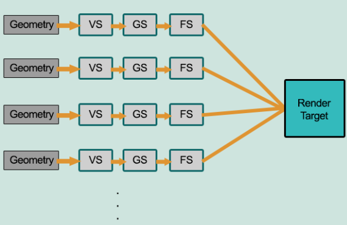
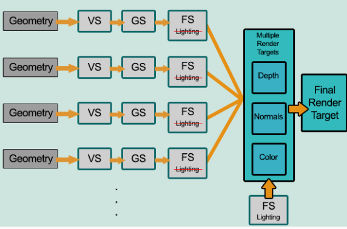
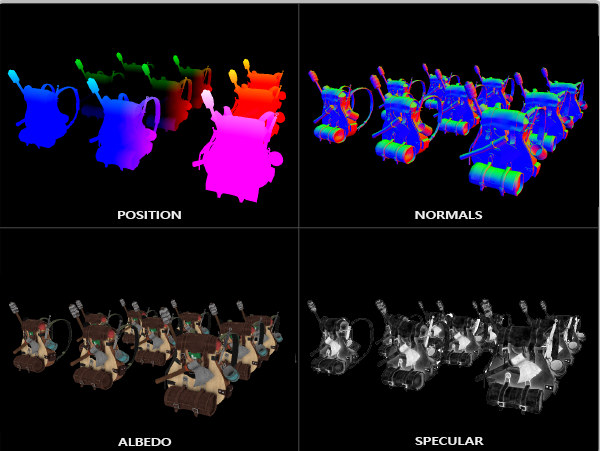

## Forward and Deferred Rendering

### Forward Rendering

#### Advantage

- conveninent to draw with multiple materials
- only one "pass" to draw

#### Disadavantage

- overdraw
- `O(M*L)`, which limited the numbers of lights
- lack of information about depth, which limited the post-processing

### Deferred Rendering

Lighting compuations are not done within fragment shader(pixcel processing). 

**G-buffer**:  the collective term of all textures used to store lighting-relevant data for the final lighting pass.

- G-buffer contains:

#### Advantage

- Make available lights increase.

- Lighting Computations are only considered on visible fragments.

  

#### Disadavantage

- High bandwidth consumption
- can't use MSAA
- Not suitable for transparent object.

